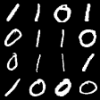

# Mammoth - An Extendible (General) Continual Learning Framework for Pytorch

  
  

## Setup

+ Use `./utils/main.py` to run experiments.
+ New models can be added to the `models/` folder.
+ New datasets can be added to the `datasets/` folder.

## Models

+ Gradient Episodic Memory (GEM)
+ A-GEM
+ A-GEM with Reservoir (A-GEM-R)
+ Experience Replay (ER)
+ Meta-Experience Replay (MER)
+ iCaRL
+ online Elastic Weight Consolidation (oEWC)
+ Synaptic Intelligence
+ Learning without Forgetting
+ Progressive Neural Networks
+ Dark Experience Replay (DER)
+ Dark Experience Replay++ (DER++)

## Datasets

**Class-Il / Task-IL settings**

+ Sequential MNIST
+ Sequential CIFAR-10
+ Sequential Tiny ImageNet

**Domain-IL settings**

+ Permuted MNIST
+ Rotated MNIST

**General Continual Learning setting**

+ MNIST-360
